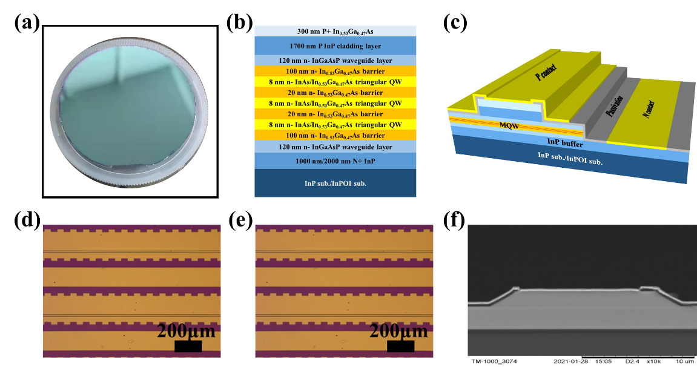
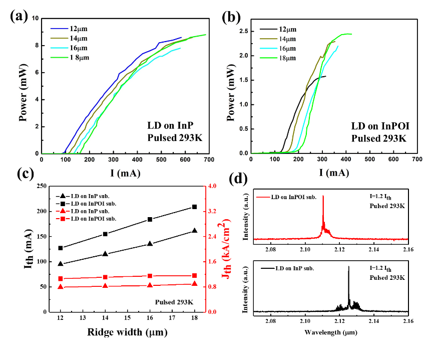

# InP on insulator substrates for 2.1&micro;m lasers on Si

## Ion-slicing technique could enable lower cost production of optoelectronics.

Researchers based in China report on 2.1&micro;m lasers produced on indium phosphide on insulator (InPOI) on silicon (Si) substrates, using ion-slicing and molecular beam epitaxy [[Jiajie Lin et al, Optics Express, v32, p19655, 2024](https://doi.org/10.1364/OE.519297)]. 

The team from Jiaxing University, Shanghai Institute of Microsystem and Information Technology, China Electronics Technology Group Corporation, and Shanghai Institute of Technical Physics, attribute improved high temperature laser performance to the relatively high thermal conductivity of Si.

The researchers see opportunities for next-generation optical networks in super- and cloud-computing from increased integration of electronics and photonics.

The team comments: "The 2-3&micro;m wavelength spectral range is critical in military, spectroscopic sensing, medical and industrial applications as this wavelength band encompasses transparent atmospheric windows and spans the absorption bands of numerous chemical molecules."

Direct epitaxy of InP on Si tends to result in high defect levels due to large differences in lattice (8%) and thermal expansion (73%) coefficients, and other factors.

 |
--- |
(a) As-prepared InPOI substrate; (b) epitaxial laser structure on InP or InPOI; (c) schematic 3D diagram of lasers; optical microscopy images of as-fabricated laser bars on (d) InP and (e) InPOI; (f) cross-section scanning electron microscope (SEM) image of as-cleaved laser on InPOI. |

The InPOI substrates were prepared using ion-slicing (Figure a). Ion-slicing raises the prospect of reusing the source InP substrate, avoiding the usual wastage of destructive substrate removal processes in conventional wafer-bonding scenarios.

The slices were achieved with co-implantation of hydrogen and helium ions into monocrystalline InP. The InP was transferred and hydrophilically bonded to a silicon dioxide (SiO2) layer on Si substrate. The separation of the ion-weakened layer from the bulk InP was achieved with 400&deg;C annealing in nitrogen for half an hour.

Ion implantation surface damage was removed with chemical mechanical polishing (CMP). The researchers report that their laser yield suffered from a poor post-CMP wash process, which left particles on the surface. The final InP thickness was 473nm. They hope that this process can be improved in future work.

The multiple quantum well (MQW) laser epitaxial structure was grown through gas source molecular beam epitaxy (GSMBE). The three triangular QWs consisted of indium gallium arsenide graded with a digital alloy growth technique from 53 to 100 to 53% indium on average. The separating barriers were indium gallium arsenide (In0.53Ga0.47As).

The GSMBE process used parameters standardized for bulk InP and not taking into consideration thermal conductivity/expansion differences between InP and Si. Photoluminescence measurements showed QW peak wavelength dependence on the substrate: 2140nm on InPOI and 2090nm on InP. The difference is attributed mainly to residual strain variation. A secondary effect could be a slight difference in growth temperature resulting in compositional variation. The different temperature is expected due to thermal conductivity differences of the substrates.

The waveguide layers consisted of indium gallium arsenide phosphide (InGaAsP). Lasers produced on bulk InP used a thinner 1&micro;m N+-InP buffer layer. The thicker 2&micro;m buffer on InPOI was designed to reduce series resistance caused by the heterogeneous substrate.

The surface roughness was 2.7nm on InPOI and 0.138nm on InP, according to atomic force microscopy (AFM) over a 5&micro;m square. The deviation on InPOI over the laser wafer reached 15nm due to the presence of particles from the CMP process.

The researchers comment: "It is expected that epitaxial layers with lower RMS roughness values can be achieved under well optimized CMP conditions for the InPOI heterogeneous substrate."

The team fabricated ridge lasers using photolithography and wet etching. Plasma-enhanced chemical vapor deposition silicon nitride, 300nm thick, was used for passivation. The p-electrode consisted of titanium/platinum/gold, and the n-electrode germanium/gold/nickel/gold.

The material was cleaved into 1mm long laser bars.

 |
--- |
Lasing properties at 293K with different ridge widths on (a) InP and (b) InPOI under 5% duty cycle, 2kHz pulsed mode; (c) threshold current/current density versus ridge width; (d) lasing spectra for 14&micro;mx1mm ridges. |

The threshold current density of ridge laser at room temperature (20&deg;C) was approximately constant: 0.79kA/cm2 on InP and 1.06kA/cm2 on InPOI (Figure b). As with the photoluminescence, the substrate structure affected the laser peak wavelength: 2.125 and 2.11&micro;m for 14&micro;m-wide ridges on InP and InPOI, respectively. The team's explanation carries over from the photoluminescence observations.

Temperature dependent continuous wave (CW) laser measurements were carried out from 78K up to 283K and 313K for 14&micro;m-wide ridge devices on InPOI and InP, respectively. The CW laser threshold at 283K (10&deg;C) was 1.3kA/cm2 on InPOI, compared with 0.76kA/cm2 on InP. The maximum single-facet laser powers reached were 11.5mW and 3.1mW on InP and InPOI, respectively. Pulsing the drive current reduced the thresholds to 0.65kA/cm2 and 1.03kA/cm2 for InP and InPOI, respectively at 283K.

The team also studied the temperature dependence of the laser wavelength at 1.2 times the threshold current injection into 14&micro;m-wide ridge devices. In CW mode, the wavelength (red-)shift rates were 0.89 and 0.91nm/K for InPOI and InP substrates, respectively.

The researchers comment: "During operation, the high thermal conductivity of Si reduces the influence of thermal effects in the active area on the red-shift caused by self-heating."

For pulsed mode operation, the shift rate was reduced to 0.87nm/K for lasers on both substrate types.

_The author Mike Cooke is a freelance technology journalist who has worked in the semiconductor and advanced technology sectors since 1997._
