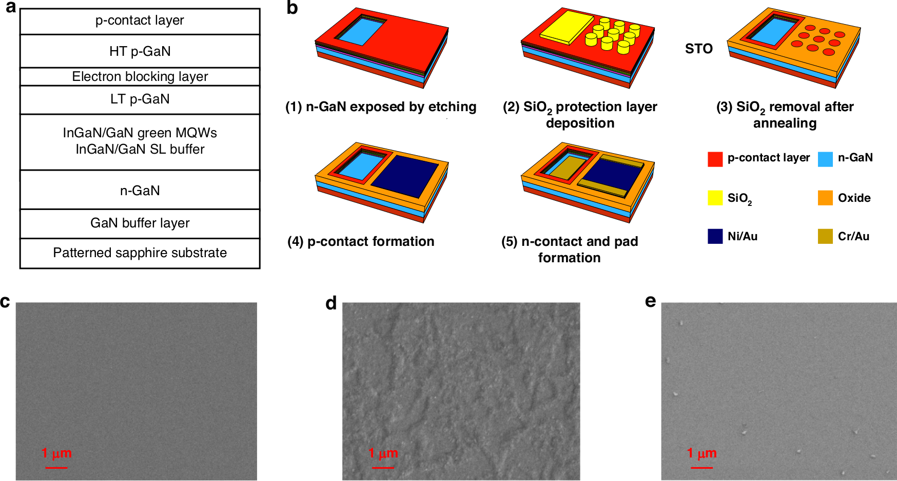
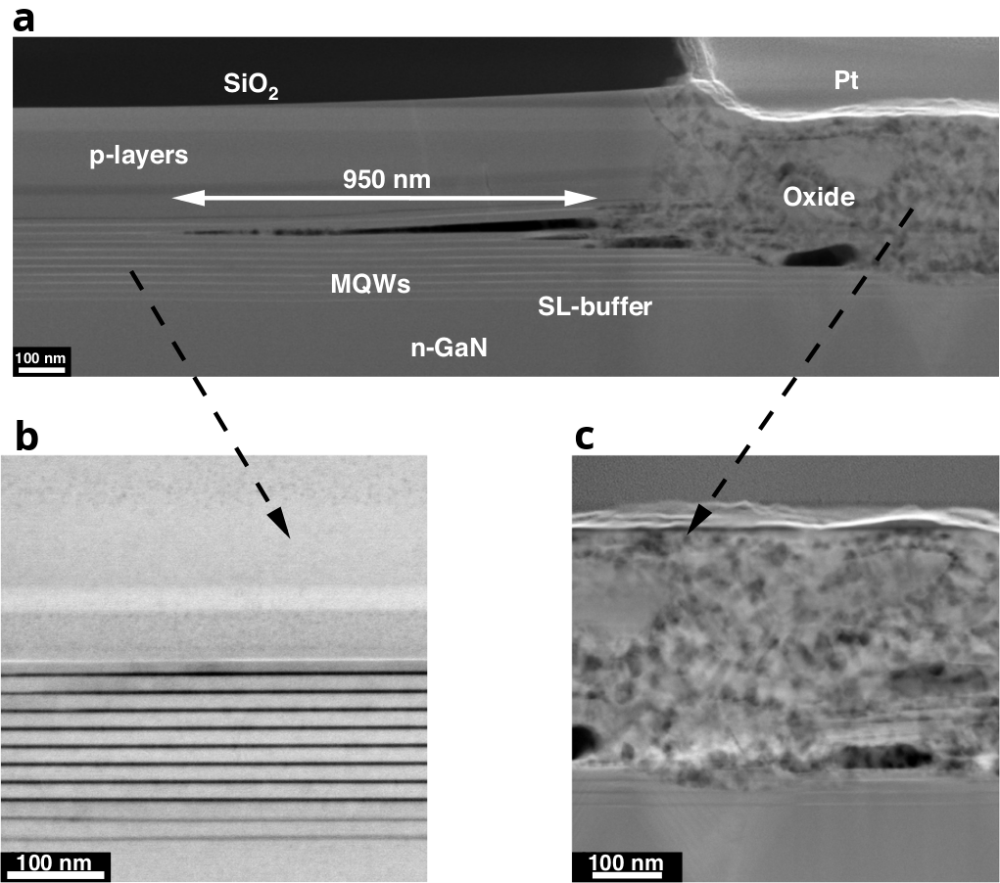
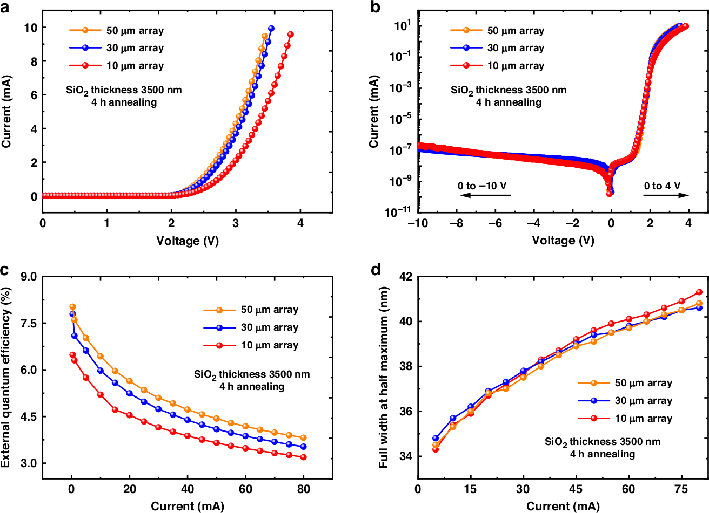

# Etching-free pixel definition for InGaN micro-LEDs

## Selective thermal oxidation proposed as viable alternative to plasma etch.

Researchers at King Abdullah University of Science and Technology (KAUST), Saudi Arabia, propose using selective thermal oxidation (STO) as a means to electrically isolate indium gallium nitride (InGaN) micro-light emitting diode (LED) arrays rather than the more usual mesa isolation through plasma etch [[Zhiyuan Liu et al, Light: Science & Applications, v13, p117, 2024](https://doi.org/10.1038/s41377-024-01465-7)].

A problem with plasma etch is that it creates highly damaged sidewalls with many defects and dangling chemical bonds, which act as sites for non-radiative carrier recombination. Avoiding plasma etching could be one means to remedying this efficiency-sapping mechanism. As devices shrink the efficiency degradation from this source increases.

"Micro-LEDs fabricated through the STO method can be applied to micro-displays, visible light communication, and optical interconnect-based memories," the researchers comment. Other applications include augmented/virtual reality (AR/VR) and other micro-display formats, which could require micro-LEDs as small as 2&micro;m. The virtually planar STO-processed arrays could also ease the monolithic integration of drive circuitry. The team also suggests potential for other III-nitride device types such as photodetectors, laser diodes, high-electron-mobility transistors, and Schottky barrier diodes.

 |
--- |
a InGaN-based green LED wafer structure. b STO fabrication process flow of micro-LED arrays. SEM images of the LED surface: c reference sample without thermal oxidization, d 4h thermal oxidization without SiO2 protection, and e 8h thermal oxidization with 3.5-µm SiO2 protection and SiO2 removal by HF vapor. |

The researchers fabricated LEDs on indium gallium nitride (InGaN) multiple quantum well (MQW) on sapphire LED wafers that had a green photoluminescence peak wavelength of 551nm (Figure a). The epitaxial structure included two InGaN/GaN superlattices (SLs) in the buffer and an 8-period InGaN/GaN MQW. The 25nm electron blocking layer (usually aluminium gallium nitride) was surrounded by p-type GaN. The 25nm p-GaN immediately after the MQW active region was grown at low temperature (LT) to avoid damage/degradation of the more delicate InGaN material underneath. High temperature (HT) p-GaN (125nm) is higher quality in terms of crystallinity and charge transport.

The STO process used plasma-enhanced chemical vapor deposition (PECVD) silicon dioxide (SiO2) to protect device regions from oxidation in the subsequent thermal annealing step. The device regions included the n-GaN contact area, exposed by plasma etching, and the array of circular LEDs. The wafers used measured 1cmx1cm. The arrays were adjusted to give the same device areas with a current of 1mA representing 5.6A/cm2.

The SiO2 was patterned with plasma etch, using a chromium hard mask. The annealing to produce oxidation of the non-active region was carried out in a tube furnace in air. The annealing temperature was a critical parameter.

The researchers comment: "Given the stability of the InGaN MQWs, especially the indium diffusion issue, the annealing temperature should not be excessively high, even with SiO2 protection. On the other hand, the temperature should be sufficiently high to oxidize GaN and InGaN in the absence of SiO2 protection."

The team fixed upon 900&deg;C as a suitable annealing temperature. The optimal annealing time for reducing reverse leakage in the final devices was found to be around 4h. Longer anneal times also resulted in devices that suffered from diffusion of oxygen from the SiO2 protection into the device structure. The SiO2 protection was removed with hydrogen fluoride (HF) vapor at 40&deg;C, which was found to have a high selectivity for removing SiO2 against the formed STO material.

The electrode metals were nickel/gold (Ni/Au) on the p-contact, and chromium/gold (Cr/Au) on the n-contact. The STO process avoided the need for any further dielectric passivation.

The team comments: "Procedures like selective dielectric etching required in traditional micro-LED fabrication for subsequent metal contact and the associated photolithography alignment were no longer necessary. Therefore, the proposed STO process for micro-LED fabrication is a self-aligned technique, reducing the complexity of photolithography for small-size device fabrication."

 |
--- |
a Cross-section transmission electron microscope (TEM) image at oxide/LED interface with 4h annealing. b Magnified image of LED MQW structure under SiO2 protection. c Magnified TEM image of oxidized material without protection. |

Inspection of the structures showed some cracking/delamination towards the edge/interface between the STO and LED regions (Figure b). The oxidized material was polycrystalline. The researchers believe the 950nm crack shown resulted from thermal mismatch between oxide and nitride materials during the heating and cooling stages of the STO process. The team suspects that this could lead to low yields in sub-10&micro;m-diameter devices, but that in the larger diameter LED arrays that the researchers studied, "the negative impact of the crack was considered to be limited because the pixel size was much larger than the crack width."

The 950nm crack occurred at the top of the MQW, so it had the benefit/silver lining of restricting hole injection/flow near the MQW/oxide interface, "reducing non-radiative recombination and improving micro-LED efficiency."

The 4h annealed 10&micro;m LEDs also demonstrated the highest wall-plug (WPE)and external quantum (EQE) efficiencies: 5.72% and 6.48% at 0.4mA, respectively.

 |
--- |
Current-voltage characteristics at forward bias: a, linear and, b, log scale, c EQE, and d spectrum FWHM of devices with 10-, 30-, and 50&micro;m pixels for 4h STO.  |

After a number of studies varying a number of process parameters, the researchers studied devices protected by 3500nm of SiO2 in a 4h STO anneal process (Figure c). The smallest 10&micro;m LEDs needed a higher voltage bias to achieve a given current injection level. At 0.4mA, the EQE decreased with reduced pixel size: 8.02, 7.79 and 6.48% for 50, 30, and 10&micro;m, respectively.

The researchers comment: "We believe that the efficiency degradation of smaller-sized devices was related to the leakage current and large resistance of the device. The latter led to a higher heat generation and junction temperature."

The team reports that it has performed "preliminary investigations" on 2.3&micro;m pixel arrays, but the experimental conditions still need significant optimization to control oxidation and cracks for improved device performance.

_The author Mike Cooke is a freelance technology journalist who has worked in the semiconductor and advanced technology sectors since 1997._