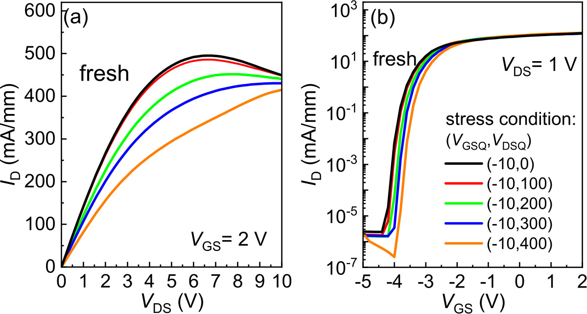

# GaN HEMTs on 8-inch sapphire

## Researchers seek to reduce production costs for devices with blocking voltages beyond 1200V.

Xidian University, and Guangdong Ziener Technology Company Ltd., China, claim the first fabrication of gallium nitride (GaN) high electron mobility transistors on 8-inch sapphire substrates [[Junbo Wang et al, IEEE Transactions on Electron Devices, published online 30 May 2024](https://doi.org/10.1109/TED.2024.3403791)]. The OFF-state breakdown voltages reached beyond 1200V.

The researchers hope their work will enable sapphire to commercially compete with GaN HEMT devices on large-diameter silicon (8- and 12-inch Si). Previously GaN HEMTs/sapphire have been produced on 6-inch diameter substrates, increasing cost per unit.

The use of sapphire substrates enables thinner GaN buffers, and simpler epitaxy structures, due to the higher quality growth, relative to material grown on Si. The sapphire substrate is also more electrically insulating than Si, which should enable kV blocking capability. [Sapphire is also more thermally insulating, which could hamper the heat dissipation needed for high power densities.]

GaN HEMTs with less than 650V ratings have seen deployment in fast chargers, [class D-Audio amplifier](https://en.wikipedia.org/wiki/Class-D_amplifier), power tools, and home appliances. Going beyond 650V, GaN HEMTs/sapphire could open the way to industrial applications such as motor drivers and charging piles.

 |
--- |
Cross-sectional schematic of fabricated GaN HEMTs on 8-in sapphire and processing flow. |

The researchers performed metal-organic chemical vapor deposition of III-nitride epitaxial material on 1.15mm thick, 8-inch diameter sapphire substrates (Figure a). The layer growth sequence was: 35nm aluminium gallium nitride (AlGaN) nucleation, 1.98&micro;m GaN buffer, 420nm GaN channel, 1nm AlN spacer, 21nm Al0.27Ga0.73N barrier, and, 2nm in situ silicon nitride (SiN) cap.

HEMTs were fabricated with ohmic titanium/aluminium/nickel/gold (Ti/Al/Ni/Au) source/drain (S/D) metal stacks. The gate (G) metal was Ti/Al/Ti. Electrical isolation was provided by nitrogen-ion implantation.

Sheet resistance mapping showed a wafer-level non-uniformity of 4%. The average resistance was 310&ohm;/square. The warpage of the GaN/sapphire was 30&micro;m.

The &omega; rocking curves for x-ray diffraction from the (002) and (102) planes demonstrate full-width at half maximum (FWHM) values of 588 and 1032 arcsec, respectively.

The researchers comment: "Further improvement of the epitaxy uniformity and quality can be made by tuning the buffer stack, gas flow, chamber pressure, temperature field, and so on."

The fabricated HEMTs aimed at 200V ratings. The gate length was 4&micro;m, while the GS and GD distances were 1.5 and 6&micro;m, respectively. The gate width was 100&micro;m.

The device operated in "normally-on" depletion mode with a negative threshold voltage of &minus;4.2V. The specific on-resistance (RON) was 6.5&ohm;-mm. The RON was higher in devices near the center of the wafer, reaching 8.6&ohm;-mm. The team says that this was the result an "intrinsic problem" of the MOCVD chamber, along with a variation of contact resistance in the range 0.7&ndash;1.5&ohm;-mm.

The OFF-state breakdown of the HEMT devices with 6&micro;m GD distance occurred at more than 500V, meeting the requirements of 200V ratings. Extending the GD distance to 16&micro;m increased the breakdown beyond 1200V, meeting 650V requirements. The researchers believe that field plates and passivation improvements could boost performance further.

 |
--- |
(a) Drain current&ndash;voltage (ID&ndash;VD) and (b) ID&ndash;gate voltage (VG) curves of the 200V GaN HEMTs on sapphire with 6&micro;m GD distance after various OFF-state stresses. |

Under 400V stress the 200V HEMTs suffered a current collapse of 41% (Figure b). For 200V stress, the collapse was reduced to 15%. The researchers see the collapse as being due to a combination of a threshold shift and charge trapping effects. Again, field plate structures could alleviate collapse/dynamic RON impacts, the team suggests.

_The author Mike Cooke is a freelance technology journalist who has worked in the semiconductor and advanced technology sectors since 1997._