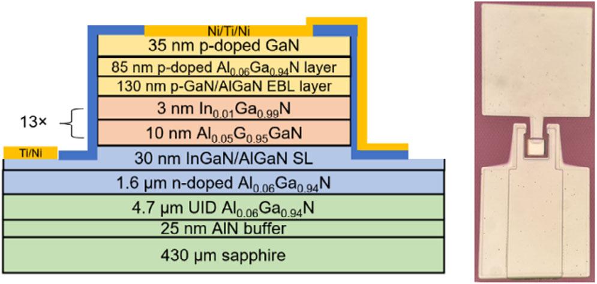
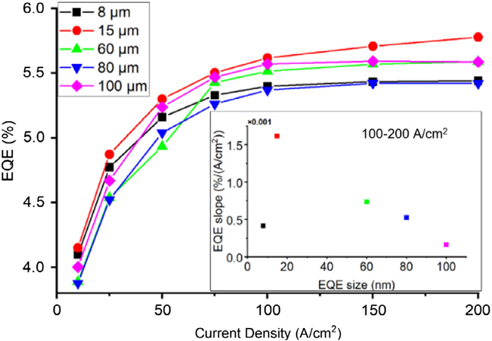

# Near size-independent UV-A micro-LED performance

## Researchers claim record for on-wafer EQE from sub-10&micro;m device.

University of Wisconsin-Madison, USA, reports on atomic layer deposition (ALD) passivation as a means to overcome the impact of sidewall damage on micron-scale light emitting diodes (micro-LEDs), resulting in near size-independent performance between 8 and 100&micro;m [[Guangying Wang et al, physica status solidi (RRL), published online 23 May 2024](https://doi.org/10.1002/pssr.202400119)].

The researchers comment on smaller devices: "Micro-LEDs have the potential to show higher stability under high current density while providing a higher light extraction efficiency and output power than regular-sized devices due to improved heat dissipation and reduced strain with decreasing device sizes."

Smaller devices can suffer from greater leakage currents that reduce efficiency, and indicate non-radiative recombination near sidewalls due to plasma etch damage and dangling chemical bonds.

The researchers point out that while micro-LEDs in other wavelengths &mdash; visible (&gt;420nm) and UV-C (&lt;280nm) &mdash; have been extensively studied, there are relatively few on near ultraviolet (UV-A, 315-400nm) devices.

"UV-A LEDs can be used in various applications such as curing, disinfection, lithography, counterfeit detection, and 3D printing" the team comments. The researchers also see potential for deployment in displays using the UV-A devices to power suitable color-conversion materials for different colored pixels.

 |
--- |
Cross-sectional schematic of UV-A LED with optical microscope image. |

The researchers fabricated micro-LEDs using metal-organic chemical vapor deposition (MOCVD)-grown UV-A wafers (Figure a). The 13x multiple quantum well (MQW) active light-emitting region consisted of indium gallium nitride (InGaN) wells and aluminium gallium nitride (AlGaN) barriers. The p-type contact region included an electron blocking layer (EBL) to avoid electron overshoot leading to increase non-radiative recombination in the p-contact layers.

The p-electrode consisted first of 100nm nickel (Ni), applied before plasma-etch mesa isolation down to the n-contact layers. The sidewall etch damage was passivated: first using atomic layer deposition (ALD) of 30nm aluminium oxide (Al2O2), and then using plasma-enhanced CVD of 270nm silicon nitride (SiNx). The n- and p-electrodes were completed with via etching and deposition of titanium (Ti) and Ni.

The fabricated devices were square-shaped with sides in the range 8&ndash;100&micro;m. All devices demonstrated a reverse leakage current density less than &sim;10&minus;5A/cm2. The smaller devices had higher reverse current density than the larger LEDs.

The injection current density for a given forward bias was also higher for the smaller devices. The researchers comment: "This behavior might be due to the reduced current crowding and improved heat dissipation in smaller sized micro-LEDs."

The electroluminescence spectrum showed a peak at 368.5nm with a full-width at half maximum (FWHM) of 14.6nm. Current-dependent shifts in the spectral peak were of order 0.028nm, close to the detection limit of the researchers' equipment.

The team comments: "These UV-A LEDs were designed with minimal indium concentration (&lt;1.5%) in the quantum well. This low indium concentration results in less indium segregation which increases the composition uniformity of the wafer, hence leading to low FWHM and stable emission wavelength. Low indium concentration also decreases the quantum-confined Stark effect caused by the InGaN/AlGaN interface, which results in a low blueshift with higher injection current density."

The quantum-confined Stark effect (QCSE) refers to electron energy level shifts due to internal electric fields arising from the different charge polarization of the chemical bonds between the different alloys.

 |
--- |
On-wafer EQE measurements of the various LEDs. |

The external quantum efficiency (EQE) behavior of the LEDs was similar up 200A/cm2 current density (Figure b). The team reports: "Devices demonstrated high on-wafer EQEs around 5.5%, with less than 0.5% difference among all the sizes at 100A/cm2. This result indicated that we successfully suppressed the leakage current of smaller sized micro-LEDs and achieved similar performance of smaller sized micro-LEDs to the regular-sized micro-LEDs."

On-wafer EQE results tend to be lower than those for fully packaged LEDs measured in an integrating sphere. The team claims the &gt;5% EQE of the 8&micro;m LED as the highest reported on-wafer EQE of UV-A micro-LEDs with a size smaller than 10&micro;mx10&micro;m. The 15&micro;m device showed the highest EQE of 5.78% at 200A/cm2.

The EQE slope for increasing current in the range 100&ndash;200A/cm2 was positive, indicating that the droop region was pushed to the &gt;200A/cm2 region. The 15&micro;m device had the greatest slope. The researchers suggest that smaller 15&micro;m device benefited from better heat dissipation and that the effect of sidewall etch damage was adequately handled through the optimized passivation, leading to compensation between these two factors.

_The author Mike Cooke is a freelance technology journalist who has worked in the semiconductor and advanced technology sectors since 1997._
